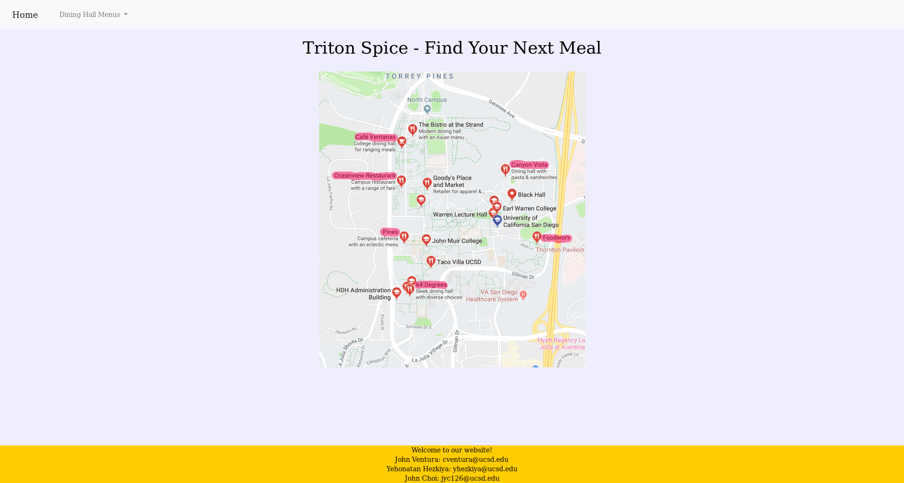

# spisfinalproject

project was designed to get data from the UCSD Housing, Dining, and Hospitality Department about item names, prices, and calories. Using python's BeautifulSoup library. Converts the data into an easy-to-read table with item, price, serving size, calories per dollar, calories per serving, and protein per serving using pandas. 

Website Links: 
triton-spice-v001.herokuapp.com (more static)
spis18-nutrition.herokuapp.com (more dynamic)

Due to UCSD updating their HTML code on their website, the project would need to be updated to work again
